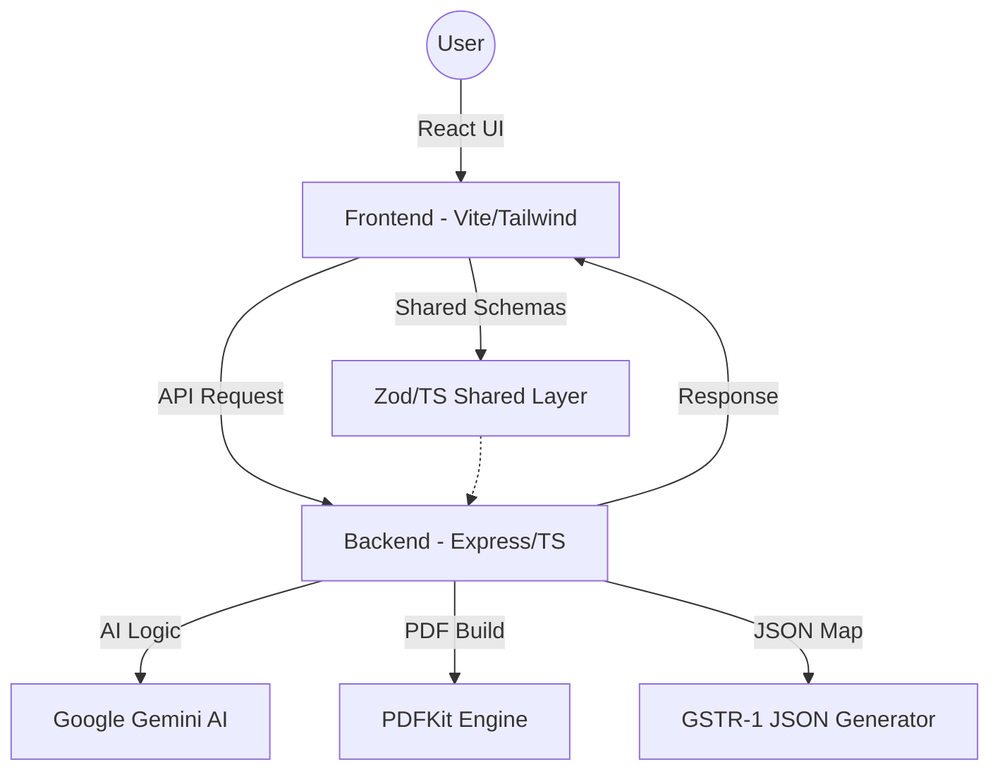

# ⚡ GSTAutopilot

**Redefining Indian Invoicing through the lens of "Internet Value."**

GSTAutopilot is not just another invoicing tool; it represents a shift in how consumer-facing software provides value. By leveraging AI to "review" and automate complex regulatory logic, we transform a historically tedious manual process into a streamlined, high-leverage digital experience.


---

## 🌐 The Vision: Internet Value for MSMEs

We believe we are in a unique global situation where "Internet Value"—the ability for digital tools to actively analyze and solve problems—is finally reaching the hands of the everyday consumer. GSTAutopilot embodies this by:
- **Intelligent Review**: AI doesn't just store data; it reviews your service and advises on compliance (SAC codes).
- **Stateless Freedom**: High-value utility shouldn't require high-friction barriers (like forced accounts or invasive databases).
- **Architectural Integrity**: A monorepo structure that ensures the frontend and backend are always in sync with shared validation schemas.

---

## ✨ Key Features

- **🤖 AI SAC Engine**: Powered by Gemini 2.5 Pro. It understands your business context to detect the correct 6-digit SAC code instantly.
- **🛡️ Deterministic Tax Logic**: Handles Intra-state (CGST+SGST) and Inter-state (IGST) splitting with 100% mathematical accuracy using integer paise.
- **📄 Pro-Grade PDFs**: Generates professional tax invoices in memory using PDFKit, ready for immediate download.
- **📊 Live Dashboard**: Real-time metrics and Recharts-powered trend analysis for the current session.
- **📥 GSTR-1 Portal Ready**: Export B2B JSON files that can be uploaded directly to the official GST portal.
- **✅ Verification Badges**: Real-time validation of GSTIN formats and checksums.

---

## 🏗️ System Architecture



---

## 🛠️ Tech Stack

| Layer | Technologies |
| :--- | :--- |
| **Frontend** | React 18, Vite, Tailwind CSS, shadcn/ui, Zustand, Recharts, Lucide Icons |
| **Backend** | Node.js, Express, TypeScript, PDFKit, Pino, Helmet, express-rate-limit |
| **AI** | Google Gemini AI (`gemini-2.5-pro-preview-05-06`) |
| **Validation** | Zod (Shared across monorepo) |

---

## 🚀 Getting Started

### Prerequisites
- **Node.js**: v20 or higher
- **npm**: v9 or higher
- **Gemini API Key**: Obtain from [Google AI Studio](https://aistudio.google.com/)

### Installation & Setup

1. **Clone & Install:**
   ```bash
   git clone https://github.com/JayantOlhyan/GSTAutopilot.git
   cd GSTAutopilot
   npm install
   ```

2. **Backend Configuration:**
   Create `backend/.env`:
   ```env
   PORT=3001
   GEMINI_API_KEY=your_key
   FRONTEND_URL=http://localhost:5173
   ```

3. **Frontend Configuration:**
   Create `frontend/.env`:
   ```env
   VITE_API_URL=http://localhost:3001
   ```

### Running Locally

```bash
# Terminal 1: Backend
npm run dev --workspace=gstautopilot-backend

# Terminal 2: Frontend
npm run dev --workspace=gstautopilot-frontend
```

---

## 🛡️ Data Privacy & Statelessness

GSTAutopilot is built on the principle of **Maximum Value, Minimum Friction**.
- **No Database**: We do not store your client or business data on our servers.
- **Local Persistence**: Business profiles are stored in your browser's `localStorage`.
- **Session Intelligence**: Invoice history for the dashboard is kept in `sessionStorage` and persists only as long as your tab is open.

---

## 📄 License

Distributed under the MIT License. See `LICENSE` for more information.

---

**Crafted for the future of Indian Business by [Jayant Olhyan](https://github.com/JayantOlhyan)**
